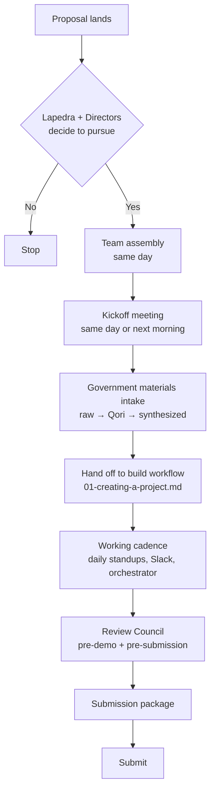

# When a Proposal Lands

This doc covers what happens between a proposal landing in Lapedra's inbox and the team being at the keyboard executing the build. It's for anyone on a project team who's just been told a project is starting. The execution workflow — planning, design, spinup, build, ship — lives in [`01-creating-a-project.md`](01-creating-a-project.md). This doc covers everything before that.

---

## The flow at a glance



---

## Quick reference — your first 24 hours as Project Lead

You've just been told a project is starting. Here's the checklist:

- [ ] Schedule the kickoff meeting (same day or next morning)
- [ ] Review the brief and any provided materials yourself before the meeting
- [ ] Identify who's on the team and notify them
- [ ] At kickoff: align on brief, timeline, roles, communication, brainstorm
- [ ] Create the project Slack channel
- [ ] Run government materials through Qori (if research is provided)
- [ ] Open Claude.ai and start [Phase 1 of 01-creating-a-project.md](01-creating-a-project.md#phase-1--plan-with-claudeai)
- [ ] Coordinate spinup with the designer/developer when planning + design are complete ([Phase 3](01-creating-a-project.md#phase-3--spin-up-the-project))
- [ ] Add government materials to `client-docs/` in the new repo
- [ ] Review starter issues and adjust based on the project plan
- [ ] Daily standups begin

Welcome to the project. The lab has your back.

---

## Step 1 — The signal

A proposal arrives. Lapedra reads it, meets with the Directors, and decides whether to pursue. If a prototype is part of what we'll deliver, the proposal moves to the lab.

That's the only part of business development you need to know about. The rest stays at the leadership level. When the project is greenlit, you'll be told, and the lab process begins.

> [!NOTE]
> If you're reading this, the proposal was greenlit — the pursue/decline decision happened above the lab. Your job starts at team assembly.

---

## Step 2 — Team assembly

Once a project is greenlit, team assembly happens the same day. There's no waiting period.

The current pattern at Friends' size is small:

| Role | Who | Notes |
|------|-----|-------|
| Project Lead | The Director the project is handed to | Currently Director of Product & UX; Director of Engineering will share this when hired |
| Designer + developer | Typically one of each | At current team size, often one person playing both roles |
| Specialists | Researcher, content strategist, accessibility specialist | Added on larger projects as needed |

When the team grows, this section gets revisited. For now, the simplest pattern is: the Project Lead names the team, the team is told, and work begins.

> [!IMPORTANT]
> Assignment is based on availability, which is why every designer and developer in the lab needs to be fully provisioned. When a proposal lands and a team needs to be assembled in hours, every available person has to be ready to spin up a project on day one.

---

## Step 3 — The kickoff meeting

Before anyone touches Claude.ai or runs the spinup script, the team meets. This is the prototype kickoff meeting and it is required.

The kickoff covers:

- **The brief.** What is the proposal asking for? What's the agency? What's the user need? What does success look like for this submission?
- **Timeline.** When is the deadline? When are interim checkpoints? When does the Review Council need to see the prototype?
- **Roles.** Who is the Project Lead? Who is the designer? Who is the developer? Who is the research synthesizer? On a small team, one person plays multiple roles — name those explicitly.
- **Logistics.** Where does the team communicate (Slack channel, named after the project)? Where does work get tracked (GitHub Issues in the project repo)? Where do government materials live (the project's `client-docs/` folder, covered in Step 4)?
- **Brainstorm.** A short brainstorming session — surface high-level approaches, identify concerns, get the team thinking together. The Project Lead leaves this meeting with context beyond the brief itself, ready to start the planning conversation with Claude.ai.

> [!TIP]
> The brainstorm at kickoff is 30 minutes, not an hour. Surface high-level approaches and concerns. The deep brainstorm happens later in [Phase 1 of 01-creating-a-project.md](01-creating-a-project.md#phase-1--plan-with-claudeai) with Claude.ai as the orchestrator.

Schedule the kickoff for the same day or the next morning. Don't let a project sit for days before the team meets.

> [!IMPORTANT]
> Do not start the spinup script before the kickoff meeting. Spinup commits real infrastructure. The brainstorm and team alignment happen first so the project starts on a shared foundation, not on assumptions.

---

## Step 4 — Government materials intake

Many proposals come with materials from the government — briefs, prior research, sample data, evaluation criteria, technical specifications, design assets. These materials are gold. They tell you what the agency cares about and where the user pain actually lives.

The lab has a structured process for handling these materials.

**Where they live in the project repo.** Every project spun up from the lab's project-template includes a `client-docs/` folder:

```
client-docs/
├── raw/                    Original materials, untouched
└── synthesized/            Output from Qori synthesis
```

The `raw/` folder holds materials exactly as the agency provided them. PDFs, Word docs, spreadsheets, original filenames preserved. Don't edit, rename, or reformat. They're the source of truth.

The `synthesized/` folder holds processed versions — the Qori output that turns 7 separate research files into a single comprehensive document the team can actually work from.

**The Qori workflow for synthesis.**

When the proposal includes prior research (which most federal proposals do), Qori is the research synthesis tool the lab uses:

1. The team member responsible for synthesis (Project Lead, designer, or researcher) uploads the government-provided documents to Qori through Slack.
2. Qori processes the documents — synthesizing themes, extracting findings, surfacing user needs, structuring the output by topic.
3. Qori writes the output to the `qori-studies` repo, organized by study.
4. The team member downloads the relevant synthesis files from `qori-studies` and adds them to the project's `client-docs/synthesized/` folder.

> [!NOTE]
> Qori outputs to `qori-studies`, not to the project repo. This is intentional — `qori-studies` is the central library of all research synthesis work the lab has done. Each project pulls a copy of its relevant synthesis into its own repo, which keeps the project self-contained while preserving Qori's central archive.

**When there's no prior research.**

Not every proposal comes with prior research. Some agencies issue a brief and expect the offeror to do their own research as part of the response. In that case:

- `client-docs/raw/` still holds whatever materials the agency provided (the brief itself, evaluation criteria, technical specs)
- `client-docs/synthesized/` holds whatever synthesis the team produces — research notes, interview summaries, competitive analysis
- The team can still use Qori, just on materials they generate rather than materials the agency provided

The intake step is the same shape. The materials may differ.

---

## Step 5 — Hand off to the build workflow

The pre-execution phase ends here. Everything from this point — Claude.ai orchestrator setup, planning artifacts, design, spinup, issue creation — lives in [`01-creating-a-project.md`](01-creating-a-project.md). This doc covers what's unique to proposals; 01 covers the build workflow that applies to every project type.

Before handing off, confirm:

- [ ] Kickoff meeting complete
- [ ] Team assigned and notified
- [ ] Slack channel created
- [ ] Government materials in `client-docs/raw/`
- [ ] Qori synthesis (if applicable) in `client-docs/synthesized/`

Then: the Project Lead opens Claude.ai and starts [Phase 1 of 01-creating-a-project.md](01-creating-a-project.md#phase-1--plan-with-claudeai). The brainstorm output from the kickoff meeting becomes early context for the planning conversation. The synthesized government materials inform the PRD, Domain Model, epics, and issue list.

> [!NOTE]
> The lab's default stack is Next.js + TypeScript + Tailwind + shadcn/ui + Supabase + Vercel. Some federal proposals require different stacks (for example, the VA's Accredited Representative Portal requires React + Ruby on Rails using their `vets-api` and `vets-website` starter branches). When a proposal specifies a stack, that overrides the default. Stack-aware spinup is a tooling investment the lab is making over time — see "What's coming" below.

---

## Step 6 — Working cadence

For most lab projects, the cadence looks like:

- **Daily standups.** 15 minutes. What did you finish, what are you working on, what's blocked. Held in the project Slack channel as an async thread or a quick voice call, depending on team preference.
- **Slack throughout.** The project channel is where async work happens. Quick questions, design mockups, build progress, client material analysis. Keep the project channel busy with real work — don't sandbag updates for the standup.
- **Project Lead maintains the project log.** Weekly minimum, or whenever a significant decision is made with Claude.ai. The log lives at `/docs/project-log.md` and captures decisions, turning points, and open questions. It is the team's shared view into the orchestrator's reasoning — the Claude.ai chat itself is not visible to teammates.
- **Project Lead checks in with Claude.ai daily.** The orchestrated workflow assumes the Project Lead stays in the loop with project state. New issues, completed work, decisions, blockers — all get reflected back to Claude.ai so it has accurate context for the next prompt cycle.

For a 1-3 week proposal response, this cadence is enough. Longer projects may add a weekly all-hands or a midpoint Review Council check-in.

> [!TIP]
> The Project Lead checking in with Claude.ai daily is what makes the orchestrator pattern work. If you skip this, Claude.ai's context drifts away from reality and its prompts to CC become less useful over time.

> [!IMPORTANT]
> Claude.ai chats are not visible to teammates — only project files are. The project log is what closes that gap. Without it, your reasoning as Project Lead lives only in your personal chat history.

---

## Step 7 — The Review Council

The Review Council is the small group that reviews lab work before it goes to the client.

**Members:**

| Role | Person |
|------|--------|
| CEO | Lapedra |
| Director of Product & UX | Currently |
| Director of Engineering | When hired |

**When they review:**

| Trigger | What they look for |
|---------|--------------------|
| Pre-demo review | What would make the lab look bad and what would make it stand out |
| Pre-submission review | The brief is answered, deliverables are complete, technical work is defensible |
| Major decision points | Scope, approach, or tradeoffs the Project Lead needs leadership input on |

**How to request a review:**

The Project Lead messages the Review Council in Slack with the project context, what's being reviewed, and the deadline. Reviews are scheduled within 24 hours when possible.

> [!IMPORTANT]
> The Review Council is not a gate that slows work down. It's a forcing function for clarity — if you can't articulate what you've built and why to three people who care about the lab's reputation, you can't articulate it to a federal evaluator either.

---

## Step 8 — Preparing the submission package

For most lab work, the deliverable is a live URL plus whatever supporting materials the project calls for. For federal procurement responses, the submission package is substantially more involved.

A real federal example: the VA's Accredited Representative Portal challenge required:

| Requirement | Detail |
|-------------|--------|
| Modified GitHub repos | Shared to a specific GitHub account designated by the agency |
| README | Build and run instructions |
| Technical document | ≤10 pages covering frontend/backend design, alternatives, APIs, and demonstrated competence across nine specific areas |
| Pain point analysis | ≤8 pages with structured evidence-based prioritization |
| Management/staffing approach | ≤2 pages |
| Docker setup | Builds from source — no pre-built images |
| Compliance certifications | SDVOSB certification 852.219-75 in the lab's case |
| Live URL | Accessible without VPN |
| No hyperlinks or embedded attachments | In any volume |

That's substantially more than a Figma file and a live URL. Federal submissions are multi-document deliverables with strict page limits, format requirements, and submission portals.

**What the Project Lead and Review Council do together:**

- [ ] **Re-read the brief** to confirm every requirement has a deliverable. Use the brief as the checklist — line by line.
- [ ] **Inventory what exists.** Live URL, codebase, project docs (project-overview, PRD, epics, ADRs), accessibility test results, Storybook deployment.
- [ ] **Identify what needs to be created.** The technical document, the pain point analysis, the staffing approach, screenshots with annotations, the README at the level the agency requires.
- [ ] **Draft each deliverable.** Use Claude (the chat assistant or CC) to draft from project context. The technical document, for example, can be drafted by pointing CC at the project's `/docs/` folder, the codebase, and the planning artifacts. The first draft comes from real project state, not blank pages.
- [ ] **Review Council reviews.** Pre-submission. They read every deliverable, confirm the brief is answered, surface anything missing.
- [ ] **Final assembly.** The package gets compiled per the agency's submission portal requirements (ATOMS for VA, others for other agencies). Page limits enforced. No prohibited elements (e.g., no hyperlinks for VA submissions). Cover pages and tables of contents added where required.
- [ ] **Submit.** Through the agency's portal plus any required emails.

> [!WARNING]
> Federal submission portals have strict format requirements. Page limits are enforced. Prohibited elements (hyperlinks for VA, for example) will cause rejection. Re-read the brief line by line as a checklist before submitting.

**Screenshots and annotations.** When the brief asks for visual proof of the prototype's behavior, screenshots are the standard format. Walk through the primary user flow, capture each screen, annotate what's happening (what the user just did, what the system is showing). Claude can help draft annotation copy. The screenshots themselves are captured manually by the Project Lead or designer.

**Demo videos.** When the brief asks for a video walkthrough, record a screen capture of the live URL with narration. Keep it short — usually 3-5 minutes covers the primary flow. Captions for accessibility.

This is the most complex submission scenario the lab handles. Smaller projects (proof-of-concept demos, internal tool prototypes) have lighter packages.

---

## Tooling and skills

The lab maintains its own tooling to make project work faster, more consistent, and more durable. Some of this lives in the spinup script and project-template; some lives as Claude Code skills that orient CC to lab conventions and workflows.

Current state:

| Tooling | Status |
|---------|--------|
| Spinup script with project types | Live. The script handles prototype, internal-tool, saas-web, ai-product, and federal project types, with extensions applied automatically (multi-tenancy, audit logging, soft deletes). |
| Claude Design with Friends design system + USWDS | Live. Both design systems load automatically in Claude Design at the org level. |
| Domain-first build workflow | Live. See [01-creating-a-project.md](01-creating-a-project.md). |
| Lab Claude Code skills | In development. See [`/skills/`](../skills/) for current state and planned skills. |

The skills initiative is the next significant tooling investment. As individual skills ship, they appear in the `/skills/` folder with their own SKILL.md.

---

## Things to figure out as we go

The lab is small, and some patterns aren't fully established yet. These are real open questions the team will work through on the first several projects:

- **Issue ticket conventions.** The spinup script creates starter issues based on project type. These are scaffolding, not gospel. Project Leads should adjust them based on the actual project. Patterns will emerge over the first several projects, and the spinup defaults will evolve to reflect what works.

- **Project log content discipline.** The project log lives at `/docs/project-log.md` and is meant to capture decisions, turning points, and open questions — a synthesis, not a transcript. The right level of detail isn't fully settled yet. Too sparse and the log can't re-orient someone returning after a break; too detailed and it becomes a chore that nobody maintains. The first few projects will calibrate this.

- **CD ↔ CC handoff feedback loop.** When a design needs to evolve mid-build — a new entity surfaces, a flow needs adjusting, a state was missed — what's the lightest-weight way to round-trip back through Claude Design without losing context? The current pattern is "stop, take the change back to the project lead, update the Domain Model, re-brief Claude Design." That works but it's heavyweight for small changes. The lab will figure out where the floor is.

These aren't blockers. They're the natural shape of a young lab figuring out its conventions in real work. Document what works as it works, and the next project benefits.

---

## What happens after this doc

Once the team has been assembled, kickoff has happened, government materials are synthesized, the project is set up, and the Slack channel is live: the technical execution begins.

For the orchestrated build workflow:
→ [`01-creating-a-project.md` — Phase 1: Plan with Claude.ai](01-creating-a-project.md#phase-1--plan-with-claudeai)

For the challenge response execution lifecycle:
→ [`04-challenge-response.md`](04-challenge-response.md)

For decommissioning when the project is done:
→ [`02-ending-a-project.md`](02-ending-a-project.md)
