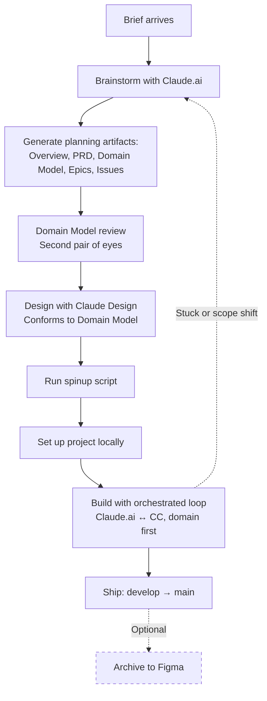

# Creating a Project

This doc covers the full lifecycle of a real project: planning, design, spinup, build, and ship. It assumes you've completed [`01-first-time-setup.md`](../01-getting-started/01-first-time-setup.md) and run through [`03-your-first-project.md`](../01-getting-started/03-your-first-project.md) at least once, so the basic loop is familiar. Real projects add a planning phase, a design phase, and a different shape for the build itself.

> [!IMPORTANT]
> Spinup credentials are set up by Lapedra when you join the lab as a developer or project lead. If your role does not require spinning up new projects — for example if you are joining an existing project as a researcher or designer — you will not need these credentials and can skip the spinup section. Ask Lapedra which sections apply to your role.

---

## How the three Claude tools work together

The lab uses three Claude tools together: Claude.ai as orchestrator, Claude Design as designer, and Claude Code (CC) as builder. You are the director — you give direction, make judgment calls, and copy-paste between the tools.

Claude.ai holds your project context across the whole engagement. It brainstorms with you, writes the prompts you send to Claude Design and Claude Code, and validates plans before implementation. You don't need to be a prompt engineer — Claude.ai writes prompts for you. Claude Design produces visual designs that conform to the project's domain model. Claude Code implements the project in your VS Code editor, building the domain layer first, then mounting screens on top.

| Tool | Job | What you do with it |
|------|-----|---------------------|
| **Claude.ai** | Orchestrator | Holds project context, brainstorms with you, writes the prompts you'll send to Claude Code, validates plans |
| **Claude Design** | Designer | Produces visual designs that conform to the project's domain model |
| **Claude Code (CC)** | Builder | Implements the project — domain first, then screens |
| **You** | Director | Give direction, make judgment calls, copy-paste between the tools |

> [!IMPORTANT]
> Expect to go back and forth with Claude.ai a lot — especially in Phase 1 and Phase 5. This is the entire point of having an orchestrator. If you find yourself accepting Claude.ai's first response without pushing back, slow down.

---

## The build loop

Every project follows this loop:



Planning and design come before spinup because the spinup script creates real infrastructure — a live database, deployed app, costs accruing. The planning and design phases are free — you brainstorm with Claude.ai, designers iterate in Claude Design, nothing is committed. By the time you run spinup you know exactly what you're building.

---

## Before you start

Make sure you have:

- Completed [`01-first-time-setup.md`](../01-getting-started/01-first-time-setup.md)
- Run through [`03-your-first-project.md`](../01-getting-started/03-your-first-project.md) at least once
- A real project to spin up

If you're not sure all your tools are set up, run a dry-run of the spinup script — it checks everything before doing anything:

```bash
./automation/spinup-typed.sh --type prototype --name=dry-run-check --dry-run
```

The script will report what's missing if anything. Fix any issues before continuing.

> [!TIP]
> Verify your shared credential is set: run `echo $LAB_SUPABASE_ORG_ID` in your terminal. If a value comes back, you're set. If it's blank, return to first-time-setup Step 11 and add it.

---

## Phase 1 — Plan with Claude.ai

### Why this phase exists

This phase is where the project actually gets thought through. Skipping or rushing it is the most expensive mistake a project lead can make. The planning artifacts produced here become the contract that Claude Design and Claude Code both follow.

If the artifacts are vague, every screen and every line of code that follows will be vague with them. The Domain Model in particular is the most consequential artifact — both Claude Design and Claude Code will conform to it. Spend time on it.

### Steps

**1. Open Claude.ai. Create a new Project (sidebar). Name it after your project.**

**2. Add the orchestrator starter doc to project files.**

Download [`claude-ai-project-starter.md`](claude-ai-project-starter.md) from the playbook. In your Claude.ai project, click "Add files" and upload it.

> [!TIP]
> Re-download the starter doc at the start of each project. It lives in the playbook so it stays current.

**3. Tell Claude to read the starter doc.**

Paste PROMPT_0 from [`claude-prompts.md`](claude-prompts.md).

**4. Brainstorm — expect lots of back-and-forth.**

Brainstorming is not a single message. You'll send something, Claude.ai will respond, you'll push back, Claude.ai will refine. Continue until the project feels real.

- Paste PROMPT_1 from [`claude-prompts.md`](claude-prompts.md) to open the brainstorm
- Paste PROMPT_2 from [`claude-prompts.md`](claude-prompts.md) to stress-test the direction before committing

> [!TIP]
> A good brainstorm has at least 5–10 back-and-forth turns. If you've only sent two messages and Claude.ai has produced the "answer," you have an outline, not a project. Keep pushing.

**5. Generate the planning artifacts.**

When the project feels real, paste PROMPT_3 from [`claude-prompts.md`](claude-prompts.md). Claude.ai will produce these five artifacts in order, pausing for your review between each:

| # | Artifact | What it is |
|---|----------|------------|
| 1 | Project overview | One page: what, who for, success, out of scope |
| 2 | PRD | Features, technical constraints, success criteria |
| 3 | **Domain Model** | Entities, relationships, IDs, the API contract |
| 4 | Epic breakdown | How the work decomposes, sequenced by dependency |
| 5 | Initial issue list | Trackable units, each small enough for one CC session |

> [!IMPORTANT]
> The Domain Model is the most consequential artifact on this page. Both Claude Design and Claude Code will conform to it. If it's wrong, every screen and every line of code that follows will be wrong with it. Spend time on it.

> [!NOTE]
> The Domain Model is lightweight for prototypes (TypeScript types + fixtures, no database) and full-weight for SaaS, AI Product, and Federal projects (schema, migrations, types, API). Same shape, different weight. Match the depth to the project type.

> [!NOTE]
> The Domain Model can evolve through Phase 2 — design discovery sometimes surfaces missing entities or fields. When that happens, the project lead updates the Domain Model as a named act in the Claude.ai chat. Design and Code never edit it themselves.

**6. Domain Model review (second pair of eyes).**

Before Phase 2 starts, a second person reviews the Domain Model. This is cheap insurance against an expensive mistake — once Claude Design and Claude Code start consuming the model, fixing it is much more expensive than catching it now.

Reviewer can be another project lead, a builder, or anyone with technical literacy. The review takes 20 minutes.

The reviewer looks for:
- Missing entities
- Unclear relationships
- Ambiguous field types
- IDs that aren't stable
- Fields that should be normalized but are flattened

The reviewer doesn't need to approve perfection — they surface anything that will cause downstream pain.

### Before you move on to Phase 2

- [ ] Project overview saved to Claude.ai project files
- [ ] PRD saved to Claude.ai project files
- [ ] Domain Model saved to Claude.ai project files
- [ ] Epic breakdown saved to Claude.ai project files
- [ ] Initial issue list saved (will become GitHub issues after spinup)
- [ ] Domain Model reviewed by a second person

---

## Phase 2 — Design

### Why this phase exists

Design conforms to the Domain Model. The domain is written first; Claude Design does not invent data shapes. This is the whole reason for the Domain Model — without it, designs will quietly define the data, and the build will reverse-engineer data from screens. Backwards. Expensive.

> [!WARNING]
> If Claude Design's output contains a value that should come from a database — a specific look, a brand list, a price — stop and ask: is this conforming to the Domain Model, or inventing it? Invented data in the design is a refactor waiting to happen.

### Design with Claude Design

**1. Open Claude Design.** Confirm the Friends design system is loaded (or USWDS for federal projects — both are live in Claude Design).

**2. Brief Claude Design with the Domain Model.** Paste PROMPT_4 from [`claude-prompts.md`](claude-prompts.md). Attach the Domain Model file before sending.

**3. Verify Claude Design summarizes the Domain Model back to you accurately** before letting it design anything. If it gets entity names or relationships wrong, correct it first.

**4. Iterate.** Like with Claude.ai, expect multiple rounds. Claude Design produces screens; you push back; it refines.

**5. When the design is ready, click "Hand off to Claude Code."** This downloads a handoff folder.

**6. Verify the handoff includes a `/fixtures/` folder** with typed mock data conforming to the Domain Model. If it doesn't, the handoff is incomplete — ask Claude Design to produce it before moving on.

> [!IMPORTANT]
> The handoff isn't complete without a `/fixtures/` folder. Components should render off fixtures shaped like the Domain Model — never hardcode values inside components. This is what lets Claude Code swap fixtures for real data later without component surgery.

> [!NOTE]
> If design surfaces a missing entity or field in the Domain Model, stop and bring it back to the project lead. The project lead updates the Domain Model in the Claude.ai project. Do not let Claude Design silently invent fields.

### Before you move on to Phase 3

- [ ] Design reviewed and approved by the project lead
- [ ] Handoff folder downloaded from Claude Design
- [ ] Handoff includes a `/fixtures/` folder with typed mock data
- [ ] All values in components come from the fixtures (no hardcoded data)
- [ ] If the Domain Model was updated during design, the updated version is saved

---

## Phase 3 — Spin up the project

### Why this phase exists

Planning and design are done. Now you provision real infrastructure.

Spinup runs in two phases. The first phase creates the repo, deploys to Vercel, and gives you a live URL in about 2 minutes. Supabase provisioning starts in the background but takes longer. The second phase (`--resume`) wires up Supabase once it's ready. This two-phase approach means you're never blocked waiting for Supabase — you get a working deployment immediately.

Make sure you are in your projects folder first:

```bash
cd ~/Projects/playbook
```

> [!WARNING]
> Run the spinup script from the playbook folder, not from another project folder. The script's relative paths assume this location.

### Pick the right project type

Each type applies different scaffolding:

| Type | When to use | What you get |
|------|-------------|--------------|
| `prototype` | Proposals, demos, validating an idea quickly | Fast, lightweight, no extensions |
| `internal-tool` | Something Friends uses ourselves | Audit logging, soft deletes |
| `saas-web` | A product with multiple paying customers | Multi-tenancy, audit logging, soft deletes |
| `ai-product` | A SaaS product with AI-driven features | Multi-tenancy, audit logging, soft deletes |
| `federal` | Government client work | Audit logging, soft deletes, USWDS theme |

Pick a name that's descriptive and lowercase with hyphens. For example: `va-benefits-prototype`, `truebid-rfp-import`, `proposal-fy26-q1`.

### Step 1 — Initial spinup (~2 minutes)

```bash
./automation/spinup-typed.sh --type=[type] --name=[project-name]
```

The script doesn't ask you anything during execution. It just runs. You'll see a banner showing what it's about to do, then pre-flight checks, then provisioning steps.

When this finishes, you'll have:

- A GitHub repo at `github.com/friends-innovation-lab/[project-name]`
- A live URL at `https://[project-name].lab.cityfriends.tech`
- A Vercel deployment (working, but Supabase pages will error — that's expected)
- A `develop` branch set as the default working branch
- Branch protection on `main`
- Starter issues and a project board on GitHub

The script will print a summary with all the URLs. Save them somewhere.

### Per-project credentials

Some projects need additional credentials — transactional email (Resend), rate limiting (Upstash), AI APIs (Anthropic), agency-specific keys. These get provisioned per-project when the project actually needs them. Lapedra will give you the values during project kickoff if applicable.

> [!NOTE]
> The live URL is configured but not reachable the instant the script exits — Vercel needs about 1 minute to complete the first production build. If you click the URL immediately and get an error, wait a minute and refresh.

### Step 2 — Wire up Supabase (~5 minutes later)

Wait about 5 minutes for Supabase to finish provisioning, then run:

```bash
./automation/spinup-typed.sh --name=[project-name] --resume
```

This is a normal part of every spinup, not a recovery step. It waits for Supabase to become active, then:

- Fetches your Supabase API keys
- Sets them in `.env.local` for local development
- Sets them as Vercel environment variables
- Configures Supabase auth redirect URLs
- Triggers a production redeploy with the real credentials

After `--resume` completes, the live URL and all Supabase-connected pages work end-to-end.

> [!NOTE]
> `--resume` is idempotent — safe to run multiple times. If Supabase isn't ready yet, just wait a few more minutes and run it again.

> [!NOTE]
> Run this once after spinup to install the accessibility test browser:
>
> ```bash
> npx playwright install chromium
> ```

For full details on what the script does:
→ [`docs/spinup-typed.md`](../docs/spinup-typed.md)

### Before you move on to Phase 4

- [ ] Spinup script completed without errors
- [ ] GitHub repo exists and you can access it
- [ ] Live URL loads
- [ ] Supabase database exists (if applicable)
- [ ] All URLs from the spinup summary saved somewhere

---

## Phase 4 — Set up the project locally

The spinup script already cloned the project to `~/Projects/[project-name]` and configured the local environment file (`.env.local`) with the Supabase credentials your app needs to run. Open it in VS Code:

```bash
cd ~/Projects/[project-name]
code .
```

This opens the project in a new VS Code window. Confirm everything works by starting the dev server:

```bash
npm install
npm run dev
```

### Save the planning artifacts to the repo

Take the project overview, PRD, Domain Model, and epic breakdown that Claude.ai produced in Phase 1, and save them to `/docs/` in the new project:

```
/docs/project-overview.md
/docs/prd.md
/docs/domain-model.md
/docs/epics.md
```

> [!NOTE]
> This makes the planning artifacts persistent and findable — not just living in the Claude.ai chat. When you (or anyone) looks at this project six months from now, the planning artifacts are right there in the repo.

### Save the design handoff to the repo

Take the handoff folder Claude Design produced and put it at `/design-handoff/` in the project. Make sure it includes the `/fixtures/` folder. CC will read from there during the build phase.

### Create GitHub issues from the issue list

Either manually create them, or ask Claude.ai to generate a `gh issue create` command for each one and run them in the terminal.

### Switch to the develop branch

The spinup script set develop as the default, but if you cloned and ended up on main, switch:

```bash
git checkout develop
```

You'll work on develop and feature branches off develop for the rest of the project. Main stays untouched until release.

### Before you move on to Phase 5

- [ ] Project opens in VS Code
- [ ] `npm run dev` works
- [ ] Planning artifacts saved to `/docs/` including `domain-model.md`
- [ ] Design handoff saved to `/design-handoff/` including the `/fixtures/` folder
- [ ] GitHub issues created
- [ ] You're on the `develop` branch

---

## Phase 5 — Build with the orchestrated loop

### Why this phase exists

This phase has the most back-and-forth of the whole project. You will not just send CC a prompt and get a finished feature. You'll talk to Claude.ai, Claude.ai will write a prompt for CC, you'll paste it into CC, CC will produce a plan, you'll paste the plan back into Claude.ai, Claude.ai will validate or push back, you'll tell CC to proceed, CC will implement, you'll tell Claude.ai what happened. Then repeat. For every issue.

This is not inefficiency. The back-and-forth is what produces good software with AI tools. Anyone who tells you they "just ask CC to build the thing and it works" is either lying, working on something trivial, or about to pay for it later in refactors.

### Build the domain first, then mount the design

The first CC session on a new project always builds the domain layer — schema, types, API stubs, and fixtures conforming to the Domain Model. Screens come later as the presentation layer over a working domain. Not first.

If your first instinct is to ask CC to build the login page, stop. Ask it to build the data foundation first.

Paste PROMPT_5 from [`claude-prompts.md`](claude-prompts.md) for the first CC build session, right after spinup.

> [!IMPORTANT]
> Open CC by clicking the Claude icon in the VS Code left sidebar. Start every CC session the same way: have CC read CLAUDE.md and tell you what it understands about the project before writing any code.

### The orchestrated loop

The FIRST work unit on any project is always the domain layer, not a screen.

For each work unit (typically one issue at a time):

1. **Tell Claude.ai what you want to do next.** Reference the issue or describe the work.
2. **Claude.ai generates a CC prompt.** Clear, scoped, with the relevant context CC needs.
3. **Paste the prompt into CC.**
4. **CC produces a plan before implementing.** This is required — CC will list the files it'll modify, the changes it'll make, and any new dependencies. CC waits for explicit approval before doing the work.
5. **Paste CC's plan back into Claude.ai.** Use PROMPT_6 from [`claude-prompts.md`](claude-prompts.md) to structure the validation. Claude validates: Does it match the intent? Are there missing considerations? Will it conflict with existing code?
6. **Claude.ai responds with "proceed" or specific adjustments.**
7. **Tell CC to proceed** (or to adjust per Claude.ai's notes).
8. **CC implements.**
9. **Tell Claude.ai what got built.** A sentence or two is fine. Claude updates project context.

Repeat for each work unit until the project is built.

> [!IMPORTANT]
> Step 4 — "CC produces a plan before implementing" — is non-negotiable. Do not let CC start writing code before showing you a plan. If CC starts implementing immediately, stop it and ask for the plan. The plan is where mistakes get caught cheaply.

### When errors happen

- Paste the error directly into CC for resolution. CC is the right tool to fix its own errors.
- After resolution, tell Claude.ai what happened so project context stays current.

### When you're stuck

- Pause the build loop. Return to brainstorming with Claude.ai.
- Ask questions. Think through the decision.
- When direction is clear, resume building.

> [!TIP]
> Being stuck is a signal to go back to Claude.ai, not a signal to push harder with CC. CC is a builder, not a thinker. Claude.ai is where uncertainty gets worked out.

### Before you move on to shipping

- [ ] All issues for this release closed
- [ ] Develop branch passing CI
- [ ] Manual smoke test passes
- [ ] Architectural decisions captured as ADRs

---

## Shipping the project

Production deploys happen by merging develop → main. This is a separate, deliberate step from regular feature work.

When you're ready to release:

1. Make sure all the work intended for this release is merged to develop
2. Make sure the develop branch is passing CI cleanly
3. Open a PR from develop → main with a release summary
4. Merge it (with appropriate review)

Vercel deploys main to the production URL automatically.

For demos before release, every PR gets a Vercel preview URL — you can share previews with stakeholders without merging to main first.

> [!CAUTION]
> Always work on a feature branch off `develop`, not on `develop` directly and never on `main`. Branch protection on `main` prevents direct pushes — but don't rely on that to save you.

---

## Archiving to Figma (optional)

**When to do this:** optional, project-by-project. Use cases include a client requiring Figma deliverables, a future designer picking up the work, or a federal handoff that demands Figma assets. Most prototypes and internal tools skip this entirely.

**When NOT to do this:** in the middle of the build. Figma is an output of finished work, not a tool in the design-to-code path.

**The mechanic:** open the final design state in Claude Design, use Anima's Figma agent to push it to Figma, share the Figma file URL as the deliverable.

> [!NOTE]
> This is not Phase 6. It's optional and most projects skip it. It sits outside the numbered phase sequence.

---

## Reference: Daily Git commands

Use these every day when working on a project. Run them from inside your project folder in the VS Code terminal.

To open the terminal inside VS Code: click **View** in the top menu then click **Terminal**.

### Make sure you're on develop and up to date

```bash
git checkout develop
git pull
```

Run this at the start of every work session.

### Create a feature branch for the work you're about to do

```bash
git checkout -b feature/[short-description]
```

Use descriptive names like `feature/login-page` or `fix/mobile-nav`.

### Check what has changed

```bash
git status
```

### Stage your changes

```bash
git add .
```

### Save your changes with a message

```bash
git commit -m "describe what you changed"
```

Keep messages short and descriptive. Examples: `"add login form"` or `"fix mobile layout on dashboard"`.

### Push to GitHub

```bash
git push -u origin feature/[short-description]
```

The `-u origin [branch-name]` part tells git "push this branch for the first time." Future pushes from this branch can just use `git push`.

### Open a pull request

```bash
gh pr create --base develop --title "Your title" --body "What this changes and why"
```

Note that the base is `develop`, not `main`. Feature branches always merge into develop. Releases (develop → main) happen separately when the project is ready to ship to production.

---

## Something not working after spinup?

→ [Troubleshooting](03-troubleshooting.md)
